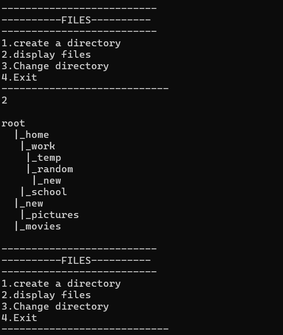

# File-system-simulator
This is a file system simulator implemented in C.  

# Current features 
- create directory
- change directory
- display file structure hierarchy
- traverse back and forth b/w directories
 
 

